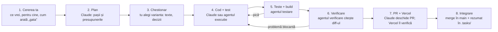

# Playbook: cum lucrez cu Claude Code pe un proiect nou

Actualizat: 10 octombrie 2026. Versiunea editabilă: [Claude Docs](https://claude.ai/code/artifact/486580f4-9285-4869-8440-26a904887e2f).

## 1. Ideea pe scurt

Metoda din OncoSentinel se poate muta în orice proiect: tu decizi ce se face, Claude organizează munca și verifică totul, iar regulile stau scrise în repo, nu în memoria cuiva. Totul pornește de la un singur fișier, `CLAUDE.md`, pe care Claude îl citește la fiecare sesiune.

Cele patru principii, valabile oriunde:

1. **Gândește înainte de cod.** Claude spune ce presupune și te întreabă când ceva e neclar, în loc să ghicească.
2. **Simplitate.** Cel mai mic cod care rezolvă problema. Nimic „pentru mai târziu”.
3. **Modificări chirurgicale.** Se atinge doar ce cere sarcina. Fără „îmbunătățiri” nesolicitate.
4. **Rezultat verificabil.** Fiecare sarcină devine un criteriu care se poate verifica: un test care pică înainte și trece după.

Împărțirea rolurilor:

| Cine | Ce face |
| --- | --- |
| Tu (proprietara) | Spui ce vrei, alegi din variante, aprobi textele și orice atinge producția |
| Claude (orchestratorul) | Înțelege cererea, face planul, pune întrebările, scrie codul sensibil, verifică, face PR-ul |
| Agenții | Fac sarcini precise (caută, testează, execută după model, verifică diff-ul) și raportează scurt |
| Repo-ul | Ține regulile (`CLAUDE.md`), agenții (`.claude/agents/`), planurile (`.tasks/`, `docs/`) |

## 2. Pasul 0 — pregătirea unui proiect nou

O singură sesiune de pregătire, înainte de orice funcționalitate, îți dă tot sistemul. Ce trebuie să existe în repo:

| Fișier / dosar | La ce folosește | Cum îl obții |
| --- | --- | --- |
| `CLAUDE.md` | Regulile proiectului: principii, structură, teste, securitate, ton, cine decide ce | `/init` generează o primă variantă; apoi o completezi cu secțiunile din șablonul de mai jos |
| `.claude/agents/*.md` | Cei patru agenți: `explorare`, `testare`, `executie`, `verificare` | Copiezi fișierele din OncoSentinel și schimbi numele proiectului, căile și comenzile |
| `.tasks/README.md` | Șablonul pentru lucrările mari, ca să poți relua după o pauză | Copiezi fișierul din OncoSentinel |
| `docs/` | Planuri, texte aprobate, conținut de specialitate | Se umple pe parcurs |
| Teste + build | Plasa de siguranță: nimic nu intră fără ele | Cere-i lui Claude: „Configurează testele și scrie primul test” |
| Verificare automată pe GitHub | Previzualizare Vercel (sau CI) pe fiecare PR | Conectezi repo-ul la Vercel o dată, din site-ul lor |

Ce adaptezi la noul proiect, în `CLAUDE.md`:

- **Structura** (unde stau componentele, logica, datele) și **comenzile** de test și build.
- **Datele sensibile** ale domeniului. În OncoSentinel sunt date de sănătate; într-un magazin ar fi plățile, într-o aplicație de școală datele copiilor.
- **Conținutul de specialitate** pe care Claude nu are voie să-l inventeze (medical, juridic, financiar) și regula „DE COMPLETAT: …”.
- **Stilul vizual** (tokenii de culoare, lățimea minimă a ecranului) și **tonul textelor**.
- **Ce rămâne la tine** (secțiunea 4) și **ce nu se deleagă** (secțiunea 5).

Cererea de pornire, de dat lui Claude într-o sesiune nouă: „Vreau să lucrăm în acest proiect ca în OncoSentinel. Citește playbook-ul (`docs/playbook-claude-code.md` din OncoSentinel), apoi propune-mi `CLAUDE.md`, agenții și `.tasks/README.md` adaptate proiectului, cu întrebările ca chestionar.”

## 3. Ciclul unei etape

Fiecare etapă trece prin aceiași opt pași; tu intervii doar la început și la chestionar. Dacă testele pică sau verificarea găsește o problemă blocantă, se întoarce la cod, nu merge mai departe.



Pașii 1 și 3 sunt ai tăi; restul îi face Claude sau un agent. După pasul 8, următoarea etapă începe din fișierul de sarcină, de preferat într-o sesiune nouă.

## 4. Rolul tău de proprietară

Nu trebuie să scrii cod; trebuie să spui clar ce vrei și să alegi bine din variante. Asta se învață repede.

**Deciziile care îți rămân, mereu prin chestionar** (variante de ales, cea recomandată prima, marcată „(Recomandat)”):

- ce intră în aplicație și în ce ordine;
- textele pe care le vede utilizatorul;
- conținutul de specialitate (medical, juridic, financiar);
- furnizorii și serviciile plătite;
- orice schimbare pe producție (baza de date, domeniu, setări).

**Cum formulezi o cerere bună** — patru lucruri, în cuvintele tale:

1. **Ce** vrei să se întâmple („Cardul Memento să dispară după ce l-am pus”).
2. **Pentru cine** și de ce („că mă încurcă dimineața”).
3. **Cum arată „gata”** („a doua zi să reapară”).
4. **Ce să nu atingă** („restul ecranului rămâne la fel”).

**Când primești un chestionar:** alege varianta recomandată dacă nu ai un motiv anume; scrie la „Other” când nicio variantă nu se potrivește. Dacă nu înțelegi o întrebare, spune asta: e semn că întrebarea trebuia pusă mai simplu.

**Când testezi tu aplicația:** notează toate observațiile mici și trimite-le într-un singur mesaj; ies într-un singur PR.

## 5. Siguranță: ce nu se deleagă niciodată

Regula de bază: tot ce atinge producția sau datele oamenilor rămâne la orchestrator și, unde e cazul, cere acordul tău explicit.

**Rămân la orchestrator, niciodată la agenți:**

- deciziile tale (chestionarele) și conținutul de specialitate;
- baza de date: migrații, SQL, reguli de acces (RLS), fișiere publice;
- configurarea build-ului, dependențele noi, workflow-urile CI;
- commit, push, PR, merge.

**Cer acordul tău de fiecare dată:** orice comandă rulată direct pe baza de date de producție, ștergeri, schimbări de domeniu sau de plan plătit.

**Reguli pentru date și chei**, de copiat în orice `CLAUDE.md`:

- în codul aplicației intră doar cheile publice (de exemplu URL-ul Supabase și anon key); cheile secrete stau în setările serviciului, nu în repo;
- datele personale se citesc și se scriu doar pentru utilizatorul autentificat;
- datele sensibile nu ajung în loguri, în adrese URL sau la servicii externe;
- schimbările de bază de date se fac prin fișiere de migrație noi, păstrate în repo, nu „de mână”.

**Dacă nu ești sigură că o acțiune e reversibilă,** cere-i lui Claude să-ți spună înainte ce se schimbă și cum se poate da înapoi.

## 6. Economie: costul și timpul ținute jos

Regulile din OncoSentinel (decizia ta din 8 octombrie 2026) merg la fel de bine oriunde:

| Regula | De ce |
| --- | --- |
| Un PR pe etapă, din `main`, integrat imediat ce e verde | PR-urile puse unul peste altul se încurcă și cer muncă în plus |
| Agentul `verificare` o singură dată pe PR | O a doua verificare se face doar după o problemă blocantă |
| Capturi de ecran doar pentru ecrane noi, decupate pe zona schimbată | O pagină întreagă costă mult și nu arată nimic în plus |
| Textele unei etape aprobate într-un singur chestionar | Un singur răspuns de la tine în loc de cinci |
| Fiecare etapă mare într-o sesiune nouă, reluată din `.tasks/` | O conversație lungă devine lentă și scumpă |
| Fără urmărirea PR-ului și fără verificări programate | Vercel termină sub un minut, deci se așteaptă direct rezultatul |
| Observațiile mici dintr-o rundă de testare, într-un singur PR | Mai puține cicluri de verificare |
| Modificările mici le face orchestratorul singur | Când explicația pentru agent ar fi mai lungă decât lucrul în sine |

În alt proiect, păstrează regulile și schimbă doar ce ține de unelte (de exemplu, dacă CI-ul durează 15 minute, nu mai merge „așteaptă direct”).

## 7. Cum înveți

Se învață făcând, în pași mici, pe un proiect care chiar te interesează. Patru săptămâni, câte o oră-două pe zi, sunt de ajuns ca să lucrezi singură în acest fel.

**Săptămâna 1 — citește sistemul pe care îl ai deja**

- [ ] Citește `CLAUDE.md` din OncoSentinel și, la fiecare regulă, întreabă-l pe Claude: „De ce există regula asta? Ce s-a întâmplat fără ea?”
- [ ] Citește cei patru agenți din `.claude/agents/` și un fișier de sarcină terminat din `.tasks/` (de exemplu `009-polish-vizual.md`).
- [ ] Deschide un PR integrat pe GitHub și urmărește: titlul, descrierea, fișierele schimbate, testul adăugat.

**Săptămâna 2 — învață vocabularul**

- [ ] Cere-i lui Claude explicații scurte, cu exemple din OncoSentinel, pentru: commit, ramură, PR, merge, test, build, migrație, RLS, variabilă de mediu, deploy.
- [ ] Rulează o dată, împreună cu el, `npm test` și `npm run build` și cere-i să-ți explice ce vezi.

**Săptămâna 3 — un proiect mic, nou, de la zero**

- [ ] Alege ceva mic (o listă de cumpărături, un jurnal de lectură) și fă Pasul 0 din secțiunea 2.
- [ ] Construiește 2–3 etape cu ciclul din secțiunea 3. La fiecare chestionar, întreabă „de ce e asta varianta recomandată?”
- [ ] Strică intenționat ceva mic și cere „scrie un test care arată bug-ul, apoi repară-l”.

**Săptămâna 4 — proiectul real**

- [ ] Scrie `CLAUDE.md`-ul proiectului adevărat, cu regulile domeniului lui.
- [ ] Prima lucrare mare cu fișier în `.tasks/`, în mai multe sesiuni.
- [ ] La final, întreabă: „Ce regulă ar trebui adăugată în `CLAUDE.md` după ce am învățat aici?”

**Obiceiul care te face să înveți cel mai repede:** după fiecare etapă, cere un rezumat în trei rânduri: ce s-a schimbat, cum s-a verificat, ce ar fi putut merge prost.

**Ce să citești:** documentația Claude Code ([code.claude.com/docs](https://code.claude.com/docs)), mai ales paginile despre `CLAUDE.md` (memorie), subagenți și setări. Pentru Git și GitHub, ghidul GitHub [Hello World](https://docs.github.com/en/get-started/start-your-journey/hello-world) (20 de minute).

## 8. Șabloane de copiat

Trei fișiere fac tot sistemul. Completează ce e între `<…>`.

**`CLAUDE.md` minimal**

```markdown
# CLAUDE.md

Reguli de lucru pentru <NUME> (<ce face, pentru cine>, <tehnologii>).

## 1. Principii
1. Gândește înainte de cod: spune presupunerile; dacă e neclar, întreabă.
2. Simplitate: minimul de cod care rezolvă problema.
3. Modificări chirurgicale: atinge doar ce cere sarcina.
4. Rezultat verificabil: un test care reproduce problema, apoi trece.

Deciziile proprietarei se prezintă ca chestionar cu variante,
cea recomandată prima, marcată „(Recomandat)”.

## 2. Proiect
- Structură: <dosare și ce conțin>.
- Teste: <comanda>. Orice comportament nou vine cu test.
  Înainte de push: <comanda de test> și <comanda de build>.
- Date și securitate: <ce e sensibil; cine are voie să citească ce>.
  Nicio cheie secretă în cod.
- Conținut de specialitate: nu inventa <doze / clauze / cifre>;
  scrie „DE COMPLETAT: …” și întreabă.
- UI: <tokeni de culoare, lățime minimă>.
- Texte: <limba, tonul, cum arată un mesaj de eroare>.

## 3. Orchestrator + agenți
<tabelul agenților; ce nu se deleagă; regulile de economie>
```

**Un agent (`.claude/agents/verificare.md`)**

```markdown
---
name: verificare
description: Citește diff-ul față de origin/main și îl verifică față de CLAUDE.md înainte de push. Doar citire.
tools: Read, Grep, Glob, Bash
model: sonnet
---

Ești verificatorul <NUME>: un al doilea cititor, care nu a scris codul.
Citești `git diff origin/main...HEAD` și verifici: corectitudine,
date, securitate, conținut de specialitate, UI, texte, teste.
Nu modifici nimic. Raport de maximum 40 de rânduri: gravitate,
fișier:linie, ce e greșit. La final: „Nimic blocant” sau lista.
```

Ceilalți trei agenți (`explorare` pe Haiku, `testare` și `executie` pe Sonnet) se copiază la fel din OncoSentinel; schimbi doar numele proiectului, căile și comenzile.

**Fișier de sarcină (`.tasks/001-nume.md`)**

```markdown
# 001 — Titlu

**Stare:** în lucru | în așteptare (pe cine/ce) | gata
**Ramura:** claude/…

## Scop
Ce vrea proprietara, în 2–3 rânduri. Deciziile ei, cu data.

## Etape
| # | Etapa | Stare | Commit |
|---|---|---|---|
| 1 | … | de făcut | |

## Rezumat pe etape
### Etapa 1 (data)
Ce s-a făcut, ce s-a verificat, ce a rămas deschis.

## Următorul pas
Un singur rând, concret.
```

## 9. Greșeli frecvente și lista finală

| Greșeala | Ce faci în schimb |
| --- | --- |
| Cereri vagi („fa-l mai frumos”) | Spune ce te deranjează și cum arată „gata” |
| Multe lucruri într-o singură cerere | O etapă = un scop = un PR |
| O conversație care ține zile întregi | Sesiune nouă pe etapă, reluată din `.tasks/` |
| Reguli spuse doar în chat | Tot ce trebuie reținut intră în `CLAUDE.md`; chatul se uită |
| „Merge, nu mai testez” | Fără test și build verzi, nu se integrează |
| Conținut de specialitate lăsat la Claude | „DE COMPLETAT” și sursa o dai tu |
| Cheie secretă lipită în chat sau în cod | Se pune doar în setările serviciului (Vercel, Supabase) |
| Agenți pentru tot | Modificările mici le face orchestratorul direct |

**Lista de verificare pentru un proiect nou:**

- [ ] `CLAUDE.md` cu principiile, structura, comenzile, datele sensibile, conținutul de specialitate, UI și tonul
- [ ] Cei patru agenți în `.claude/agents/`, adaptați
- [ ] `.tasks/README.md` cu șablonul
- [ ] Teste și build care trec pe `main`
- [ ] Verificare automată pe PR (Vercel sau CI)
- [ ] Cheile secrete în setările serviciilor, nu în repo
- [ ] Prima etapă mică, dusă până la PR integrat
